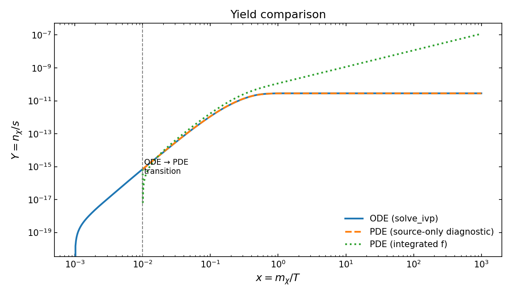
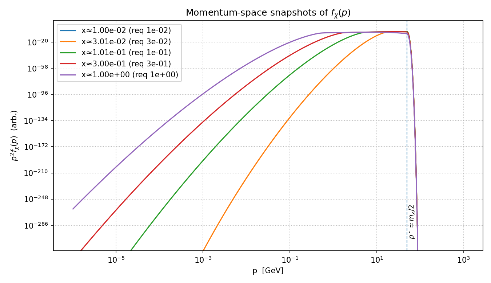

# 🔥 Freeze-in CFD: Finite-Volume Boltzmann Solver (ODE↔PDE)

**A compact, CFD-style solver for cosmological freeze-in dark matter production.**  
This project demonstrates how **finite-volume (CFD-inspired)** techniques can be adapted to cosmology.  
It evolves the dark-matter freeze-in yield using both an **ODE benchmark** and a **PDE formulation** for the phase-space distribution $f(p, x)$.  
The solver provides a conservative, reproducible framework for studying early-universe particle production.

---

## 🧮 Theory Snapshot

**ODE (benchmark)**  

$$
\frac{dY}{dx} = \frac{1}{s(T)} \frac{C(T)}{H(T)\,x}, \qquad C(T) = 2\,\Gamma_A\,n_A^{\rm eq}(T)
$$

**PDE (Finite Volume in momentum)**  

$$
\partial_x f_\chi + \partial_p \big( (-p/x)\, f_\chi \big) = S(x, p), \qquad
\int_0^\infty p^2 S\,dp = \frac{2\pi^2}{g_\chi} \frac{C}{H x}
$$

For a detailed derivation and references, see [`docs/theory.md`](docs/theory.md).

---

## ⚙️ Key Numerics

- Logarithmic grids in **$x = m_\chi / T$** and **$p$**.  
- MUSCL (minmod) reconstruction for upwind fluxes in $p$.  
- Fixed-step march on a log-spaced $x$-grid (fast; no CFL bottleneck).  
- Adaptive **ODE–PDE transition** at small $x$ for improved accuracy and computational efficiency.  
- Conservative accumulation of yield ensures agreement between PDE and ODE curves.

---

## 🚀 Quickstart

```bash
python -m venv .venv && source .venv/bin/activate
pip install -r requirements.txt

# Yield comparison (ODE vs PDE)
python examples/run_pde.py

# Momentum-space snapshots of f(p)
python examples/plot_f_snapshots.py
```

Outputs are written to `docs/figures/`.

---

## 🔬 Results Preview

### Freeze-in Yield Comparison

The ODE (`solve_ivp`) and CFD-style finite-volume PDE agree closely for the **source-only** diagnostic, confirming conservative evolution.

<p align="center">
  
</p>

### Momentum-Space Evolution

Snapshots of the DM phase-space distribution $f_\chi(p)$ at different epochs $x = m_\chi / T$, showing the redshifting injection peak near $p \simeq m_A / 2$.

<p align="center">
  
</p>

---

## 🧱 Project Layout

```
src/freezein_fv/
  __init__.py
  physics.py          # microphysics & ODE RHS
  ivp_reference.py    # high-accuracy ODE solution (solve_ivp)
  pde_solver.py       # FV PDE in momentum, fixed-step in x, snapshots
examples/
  run_pde.py          # reproduces the yield comparison figure
  plot_f_snapshots.py # plots f(p) snapshots across x
docs/
  index.md
  theory.md
  figures/            # output figures (PNG, PDF)
```

---

## 🌌 Scientific Summary

This solver bridges **cosmological kinetic theory** and **computational fluid dynamics (CFD)**.  
It treats the Boltzmann freeze-in equation as a transport problem in $(p, x)$ space, discretized with a finite-volume scheme analogous to those used in CFD.  
The approach opens a path to extend cosmological freeze-in studies toward full **PDE-based transport solvers**, potentially integrable into CFD frameworks such as **OpenFOAM** or **COMSOL**.

---

## 👤 Author
**Mubarak A. S. Mohammed  (GitHub: @Mubarakaphy)** 

## 📖 Citation
If you use this code or build upon it, please cite it as:

```bibtex
@misc{Abdal2025_FreezeInCFD,
  author       = {Mubarak A. S. Mohammed},
  title        = {Freeze-in CFD: Finite-Volume Boltzmann Solver (ODE↔PDE)},
  year         = {2025},
  publisher    = {GitHub},
  howpublished = {\url{https://github.com/Mubarakaphy/Freeze_In-FV-CFD}},
  note         = {Version 1.0 – Public Release}
}
```

## ⚖️ License

Distributed under the MIT License. See the `LICENSE` file for details.
