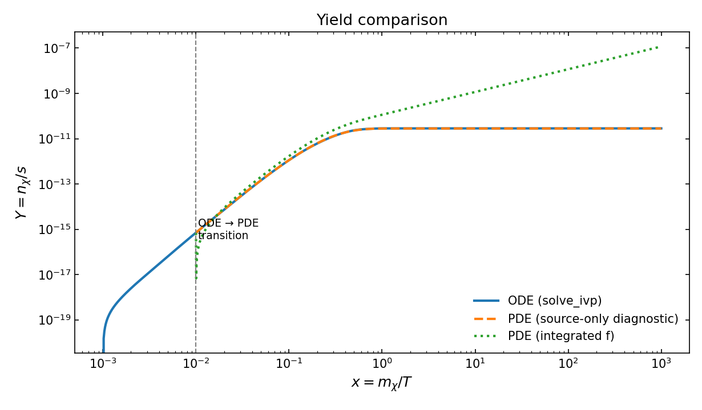
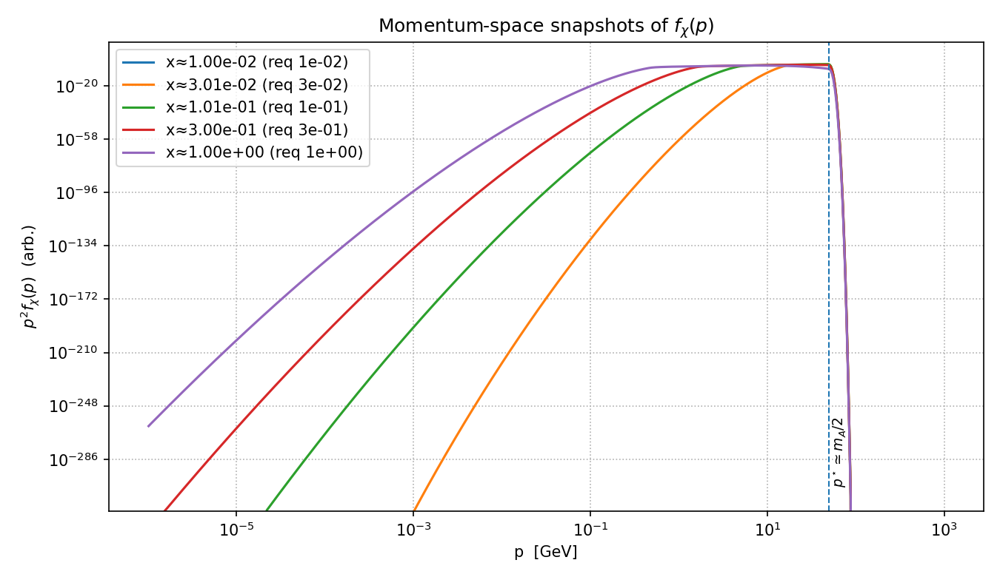

## Results

### 1. Freeze-in yield comparison

This plot compares the **ODE benchmark** (solved with `scipy.solve_ivp`)  
against the **CFD-style finite-volume PDE solver**.  
The two curves agree extremely well for the “source-only” diagnostic,  
confirming that the finite-volume discretization conserves the freeze-in yield.

  

---

### 2. Momentum-space snapshots

Snapshots of the DM phase-space distribution $f_\chi(p)$ at different $x = m_\chi/T$.  
As the Universe cools, the injection band around $p \simeq m_A/2$  
gradually redshifts and the distribution broadens.

  

---

### 3. Normalized distribution shapes

Here, $p^2 f_\chi(p)$ is normalized to unity, highlighting how the  
distribution evolves in shape rather than amplitude.

  

---

### 4. Energy-weighted spectra

The $p^3 f_\chi(p)$ weighting emphasizes contributions to the comoving  
energy density, useful for comparing kinetic vs thermal regimes.

  

